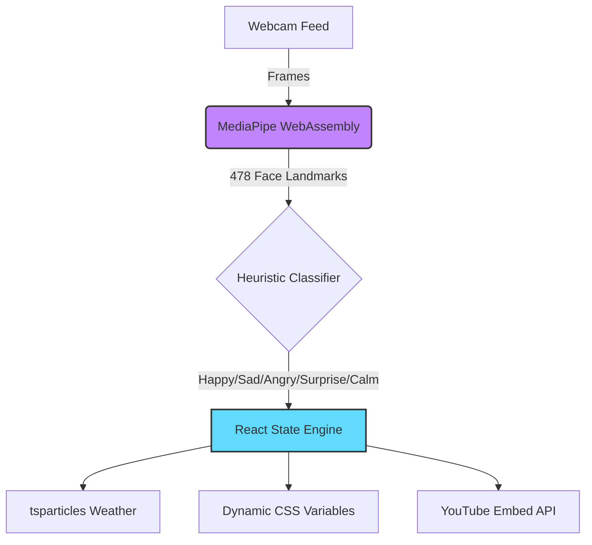

<div align="center">
  
# 🎵 MoodTunes

**The Next-Generation Emotion-Aware Music Player**

[](https://reactjs.org/)
[](https://vitejs.dev/)
[](https://mediapipe.dev/)
[](https://youtube.com/)


*Smile. Frown. Gasp. Let your face be the DJ.*

</div>

---

## 🌌 The Vibe

**MoodTunes** is an AI-powered music player that reads your facial expressions in real-time and dynamically changes the music, background, and UI to match your exact vibe. 

Zero clicks required. Just turn on your camera and let the AI build the perfect atmosphere for your current mood.

---

## ✨ Insane Features

- 🧠 **On-Device AI Tracking:** Powered by Google's MediaPipe, analyzing 52 distinct facial blendshapes in real-time at 60 FPS. Your camera data *never* leaves your device.
- 🎨 **Dynamic Glassmorphism UI:** The entire interface literally shifts colors, glows, and shadows based on what you're feeling.
- 🌦️ **Reactive Particle Weather:** Fully interactive background physics! Sunbeams when you're happy, rain when you're sad, floating fire embers when you're angry.
- 📐 **3D Holographic Tilt:** Move your mouse to physically tilt the UI panels in 3D space with dynamic glare effects.
- 📸 **Polaroid Snapshots:** Catch a vibe? Snap a polaroid of your current expression which drops into a beautiful scrollable mood gallery.
- 📺 **Infinite Auto-Play:** Curated playlists of over 100+ YouTube tracks with auto-skip technology to ensure the music never stops.

---

## 🛠️ Tech Stack & Architecture



### 📂 Directory Structure

```text
MoodTunes/
├── src/
│   ├── components/         # 🧱 UI Building Blocks
│   │   ├── Dashboard.jsx   # 🧠 The Brain (Layout & Orchestration)
│   │   ├── WebcamFeed.jsx  # 📷 Camera + Canvas Face Mesh
│   │   ├── MusicPlayer.jsx # 🎵 YouTube Embed Logic
│   │   └── MoodGallery.jsx # 📸 Polaroid Snapshot Gallery
│   │
│   ├── hooks/              # 🎣 Custom React Hooks
│   │   ├── useEmotionDetection.js # 🤖 MediaPipe AI Loop
│   │   └── useMoodPlaylist.js     # 🎶 Track Selection Logic
│   │
│   ├── utils/              # 🧰 Core Engines
│   │   ├── emotionClassifier.js   # 🧮 Advanced blendshape mathematics
│   │   └── moodConfig.js          # 🎨 Color palettes & song databases
│   │
│   └── index.css           # 💅 Global glassmorphism design system
```

---

## 🚀 Quick Start Guide

Ready to let your face control the music?

**1. Clone the repository**
```bash
git clone https://github.com/stackpilotkulsum/MoodTune.git
cd MoodTune
```

**2. Install Dependencies**
```bash
npm install
```

**3. Launch the AI Engine**
```bash
npm run dev
```

**4. Vibe out**
Open `http://localhost:5174`, allow camera permissions, and start making faces! 🤪

---

## 🤝 Contributing

Got a crazy idea for a new mood? Want to add Jedi hand gestures? Pull requests are absolutely welcome! 

1. Fork the Project
2. Create your Feature Branch (`git checkout -b feature/AmazingFeature`)
3. Commit your Changes (`git commit -m 'Add some AmazingFeature'`)
4. Push to the Branch (`git push origin feature/AmazingFeature`)
5. Open a Pull Request

---

<div align="center">
  <p>Built with ☕ and AI magic.</p>
</div>
